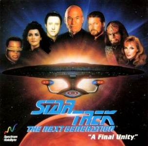

# Extract Audio Files from Star Trek: The Next Generation: A Final Unity

I'm a big fan of Star Trek: The Next Generation, including their 1996 game: [A Final Unity](https://en.wikipedia.org/wiki/Star_Trek:_The_Next_Generation_%E2%80%93_A_Final_Unity).

Awhile ago, I found [this neat repo](https://github.com/discully/afinalunity) which can be used to
extract audio files from the game, but only one at a time.  Well, I want *all* the audio files,
so I built this repo out to make that possible.

## Usage

Stand up the Docker container:
- `./bin/build.sh` - Build the `sttng` Docker image
- `./bin/run.sh` - Run the `sttng` Docker image in an interactive shell

While in the Docker container, these are the scripts you'll want to run:
- `/mnt/bin/1-extract-files.sh` - Extract the RAC, MAC, and VAC files from the STTNG.ZIP file.
- `/mnt/bin/2-extract-subtitles.sh` - Extract the subtitles to a JSON file
- `/mnt/bin/3-extract-wav-files.sh` - Extract the actual WAV files

Files will be written to `/mnt/files/`, which is really `files/` in the host filesystem.

## Credits

Docker container and scripts mentioned above built by me.

The underlying Python scripts which do the extraction can be found at
[https://github.com/discully/afinalunity](https://github.com/discully/afinalunity) and
were created by [Dr Daniel I. Scully](https://danielscully.uk/).

